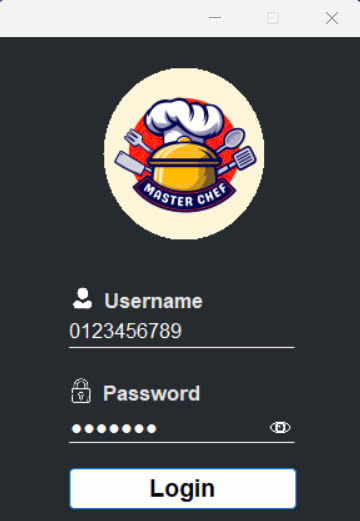
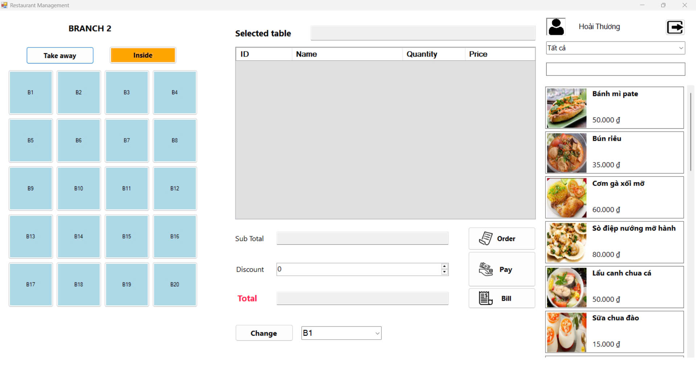
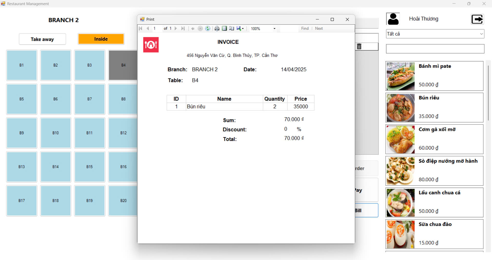
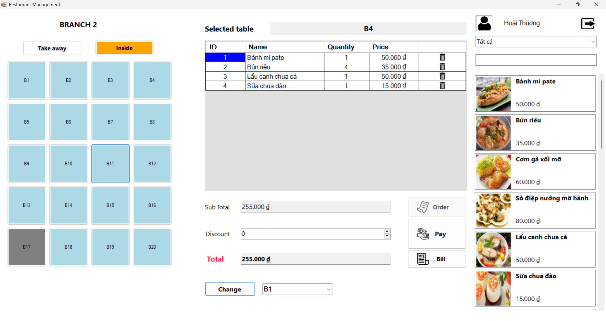
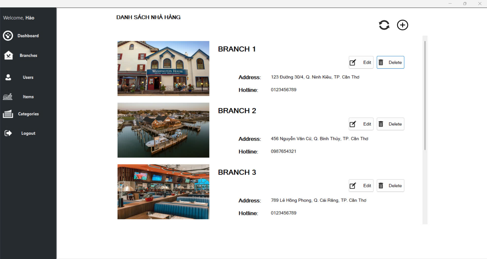
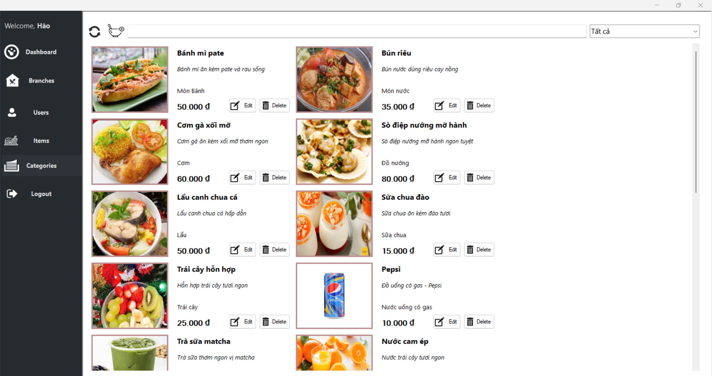

# RESTAURANT_MANAGEMENT

A desktop application for managing restaurant operations, built with .NET Framework.

## 🧾 Features

- Table and order management
- Menu and dish management
- Invoice generation
- Staff and user account management
- SQL Server database integration

## 🛠️ Technologies

- C# with Windows Forms
- .NET Framework
- SQL Server
- ADO.NET

## 📂 Project Structure

<pre>
RESTAURANT_MANAGEMENT/
├── bin/             # Compiled binaries (excluded from Git)
├── obj/             # Temporary object files (excluded from Git)
├── Database.sql     # SQL script for database schema
├── *.sln            # Visual Studio solution file
├── *.csproj         # Project file
└── README.md
</pre>

## 🚀 Getting Started

1. Clone the repository:
   ```bash
   git clone https://github.com/MuniHao/RESTAURANT_MANAGEMENT.git
   ```

   Open the solution file (.sln) in Visual Studio.

   Restore NuGet packages if prompted.

   Set up the database using Database.sql.

   Build and run the application.


## 📌 Notes
- Ensure SQL Server is installed and running.
- Update the connection string in the application settings as needed.

## 📷 Screenshots
<p align="center">
  
   <br/>
   <br/>
   <br/>
   <br/>
   <br/>
</p>
